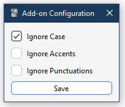
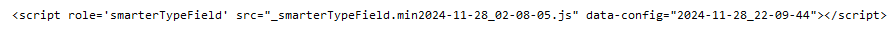

<h1 align="center">
	SmarterTypeField
</h1>
<h2 align="center">
	Flexible matching for <code>{{type:}}</code> field
</h2>

    

<h3 align="center" style="font-size:2em;">⏬🔽⏬</h3>

    

Adds three options to the `{{type:}}` field in Anki.

-   `ignore_case` makes the type field ignore case when checking the answer.
-   `ignore_accents` allows the type field to disregard accents when checking the answer.
-   `ignore_punctuations` makes the type field ignore punctuation marks when checking the answer.
    The options can be used together or separately.

## Installation

-   #### Automatic install

Simply install [the addon](https://ankiweb.net/shared/info/1371444066) on your AnkiDesktop. The changes made by the addon will apply to both **AnkiDesktop** and **AnkiDroid**.

## FAQ

### I installed the add-on, but it's not working. What do I do?

> 1.  First, you need to restart Anki after installing the add-on.
> 1.  Check the 'Back Template' of your card to see if the `{{type:}}` field is present and the script tag is added. It looks like this:
> 
> 1.  If the script tag is present and it still doesn't work as expected, please open a support ticket above, labelled _'Issues'_; If on AnkiWeb, click _'Contact Author'_.

### What the Heck is the "Back Template" of my Anki Cards?

> The Back Template is the other side of the flashcard, it's the code that's rendered when you show the answer.
> 

### How do I get to this "Back Template"?

> 1.  Click `Tools` in the Anki Toolbar.
> 1.  Click `Manage Note Types`.
> 1.  Select the Card that has the `{{type:}}` fields.
> 1.  Click `Cards` button on the right.
> 1.  TA DAAAAAA!

### How does this work?

> This add-on checks what you type against the correct answer without worrying about uppercase/lowercase letters, accents, or punctuation. For example, "ÀNKI!" and "Anki" can be treated the same based on your settings. It adds a script to your card templates that use the `{{type:}}` field without changing any existing code. This makes the add-on work on **AnkiDesktop**, **AnkiDroid**, and **AnkiMobile**.

### How to uninstall?

> Go to Addons->SmarterTypeField->Click "delete addon". This will also automatically clean up the script tag from your cards.
> If you had opted for manual install, then you need to manually uninstall it by retracing manual installation the steps. Basically, delete the `<script>` tag from your card(s).

### Does this work in Anki Version 2.x.xx

> I've tested on Anki Version 2.1.48 and Version 2.1.63. I would assume it to be working in later versions as well. If not, please open a support ticket above, labelled _Issues_.
